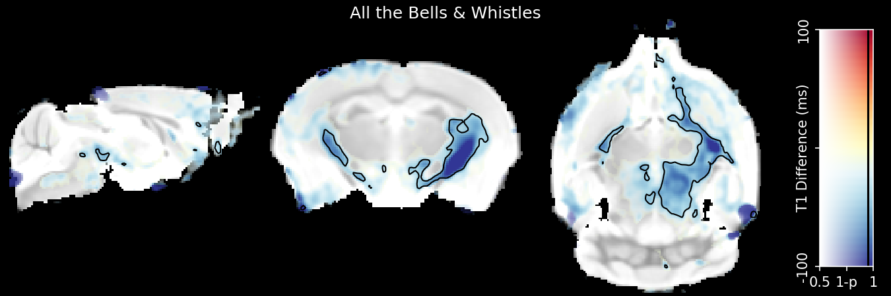

# Not Another Neuroimaging Slicer - nanslice #

Credit / Blame / Contact - Tobias Wood - tobias.wood@kcl.ac.uk

This Source Code Form is subject to the terms of the Mozilla Public
License, v. 2.0. If a copy of the MPL was not distributed with this
file, You can obtain one at http://mozilla.org/MPL/2.0/.
 
If you find the tools useful the author would love to hear from you.

# Brief Description #

This is a pure Python module for creating slices through neuro-imaging datasets.
The main motivation for building this was to implement the 'Dual-Coding'
visualisation method that can be found in this paper: 
http://dx.doi.org/10.1016/j.neuron.2012.05.001. However, it then expanded to
include standard visualisation methods, and an interactive viewer for Jupyter
notebooks.

Documentation can be found at https://nanslice.readthedocs.io/en/latest/.

In dual-coding instead of plotting thresholded blobs of T-statistics or p-values
on top of structural images, transparency (or alpha) is used to convey the 
p-value of T-statistic, while color can be used to convey the effect size or
difference in group means etc. Finally, contours can be added at a specific
p-value, e.g. p < 0.05. In this way, 'dual-coded' overlays contain all the
information that standard overlays do, but also show much of the data that is
'hidden' beneath the p-value threshold.

Whether you think this is useful or not will depend on your attitude towards
p-values and thresholds. Personally, I think that sub-threshold but
anatomically plausible blobs are at least worth *showing* to readers, who can
then make their own mind up about significance.

This is a sister project to https://github.com/spinicist/QUIT. I mainly work
with quantitative T1 & T2 maps, where group mean difference or "percent change"
is a meaningful, well-defined quantity. If you use these tools to plot "percent
BOLD signal change", I hope you know what you what you are doing and wish you
luck with your reviewers.

# Installation #

NaNSlice is available on `PyPI`. Run `pip install nanslice` to install the
stable version. Alternatively, clone the repository from Github and then run
`pip install -e .` to use the development version.

# Performance #

These are Python scripts. The core sampling/blending code was written over 3
evenings while on the Bruker programming course. Most of nanviewer was written
in literally 4 hours across a Monday and Tuesday. After a refactoring, it is
surprisingly responsive on my MacBook. The Jupyter viewer, on the other hand,
is not wildly performant. Patches are welcome!