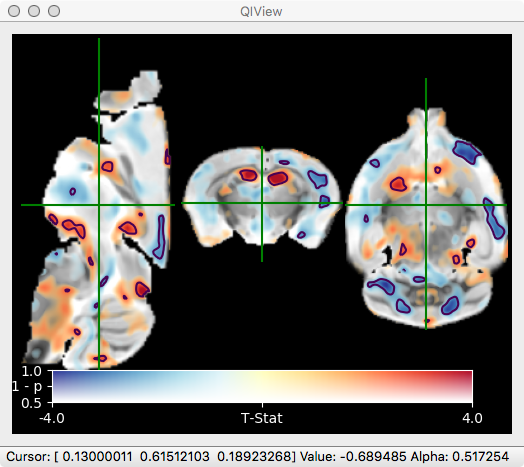

# QIView - An implementation of 'Dual-Coding' #

Credit / Blame / Contact - Tobias Wood - tobias.wood@kcl.ac.uk

This Source Code Form is subject to the terms of the Mozilla Public
License, v. 2.0. If a copy of the MPL was not distributed with this
file, You can obtain one at http://mozilla.org/MPL/2.0/.
 
If you find the tools useful the author would love to hear from you.

# Brief Description #

These scripts are an implementation of the 'Dual-Coding' visualisation method
that can be found in this paper: http://dx.doi.org/10.1016/j.neuron.2012.05.001

In short, instead of plotting thresholded blobs of T-statistics or p-values
on top of structural images, transparency (or alpha) is used to convey the 
p-value, while color can be used to convey either T-statistic, or difference
in group means etc. Finally, contours can be added at a specific p-value, e.g.
p < 0.05. In this way, 'dual-coded' overlays contain all the information that
standard overlays do, but also show much of the data that is 'hidden' beneath
the p-value threshold.

Whether you think this is useful or not will depend on your attitude towards
p-values and thresholds. Personally, I think that sub-threshold but
anatomically plausible blobs are at least worth *showing* to readers, who can
then make their own mind up about significance.

Finally, this is a sister project to https://github.com/spinicist/QUIT, hence
the name. I mainly work with quantitative T1 & T2 maps, where group mean
difference or "percent change" is a meaningful, well-defined quantity. If you
use these tools to plot "percent BOLD signal change", I hope you know what you
what you are doing and wish you luck with your reviewers.

# Usage #

There are two scripts - `qiview.py` is a simple interactive viewer and
`qislices.py` can be used to generate figures for publication. They have been
designed around the output of FSL `randomise`, but should work with other stats
programs as well. To run `qiview` type:

`python qiview.py path/to/base_image path/to/mask path/to/tstat path/to/pstat`

The mask will be used to set the bounding box for the slices.

`qislices.py` has a help string - run `python qislices.py` to show it. Options
are provided to choose the number of slices, colormap and the limits for color
and alpha. 

# Dependencies #

I wrote this using an Anaconda distribution, with:
* Python 3.5.2
* Numpy 1.11.3
* Matplotlib 2.0.0
* Nibabel 2.0.2
* PyQt5 5.6.0

# Performance #

These are Python scripts. The core sampling/blending code was written over 3
evenings while on the Bruker programming course. The viewer was written in
literally 4 hours across a Monday and Tuesday. Do not expect clicking around
images to be particularly fast, even on a beefy computer. Patches are welcome!